elasticsearch 실습 정리

---

Elasticsearch 시작하기
======================

---

### java 설치 (root로 설치)

-	yum install java

### elasticsearch 설치

##### 1. repo 등록 설치

-	/etc/yum.repos.d/elasticsearch.repo 생성 및 다음 추가

```shell
[elasticsearch-6.x]
name=Elasticsearch repository for 6.x packages
baseurl=https://artifacts.elastic.co/packages/6.x/yum
gpgcheck=1
gpgkey=https://artifacts.elastic.co/GPG-KEY-elasticsearch
enabled=1
autorefresh=1
type=rpm-md
```

```shell
$ yum repolist
$ yum install elasticsearch
```

##### 2. RPM으로 설치

```shell
$ wget https://artifacts.elastic.co/downloads/elasticsearch/elasticsearch-6.4.0.rpm
$ rpm -ivh elasticsearch-6.4.0.rpm
```

##### 3. zip, tar로 설치

-	root가 아닌 일반 계정으로만 설치 가능 (root로 실행 불가)

-	설치할 dir에서 압축 해제

```shell
# zip파일
$ wget https://artifacts.elastic.co/downloads/elasticsearch/elasticsearch-6.4.0.zip
$ unzip elasticsearch-6.4.0.zip $ unzip elasticsearch-6.4.0.zip
# tar파일
$ wget https://artifacts.elastic.co/downloads/elasticsearch/elasticsearch-6.4.0.tar.gz
$ tar -xzf elasticsearch-6.4.0.tar.gz
```

-	압축해제 후 기본 파일 리스트<br> LICENSE.txt <br> NOTICE.txt <br> README.textile<br>**bin**: app 핸들링 관련 파일 <br>**config**: yml파일 등 설정관련 파일 <br>**lib**: jar lib파일 <br>**logs**: 로그파일 <br>**modules**: app의 모듈 관련 파일 <br>**plugins**: 내부 plugins파일 (외부 plugin을 이곳에 설치하면 에러 남) <br>

<br>

-	rpm 설치와 비교 했을때 config, logs 추가로 생성

-	rpm 설치 시, config 폴더 파일들은 **/etc/elasticsearch** 에 설치 됨

### elasticsearch 실행

```shell
# default yml파일 보관
cp /etc/elasticsearch/elasticsearch.yml /etc/elasticsearch/elasticsearch.yml.template
```

-	elasticsearch.yml의 다음을 제외하고 삭제

```shell
path.data: /var/lib/elasticsearch
path.logs: /var/log/elasticsearch
```

```shell
# 실행
$ service elasticsearch start
# 중지
$ service elasticsearch stop
# es버전/프로세스 확인
$ rpm -qa | grep elastic #rpm설치 시,
$ ps -ef | grep elastic
# app 반응 확인
$ curl localhost:9200
```

-	시작 안되었을 시, 다음의 로그 확인

	1.	rpm 설치: /var/log/elasticsearch/elasticsearch.log
	2.	소스 설치: <path_installed>/logs/elasticsearch.log

-	기본 경로

	-	설치파일: /usr/share/elasticsearch/
	-	conf파일: /etc/elasticsearch/
	-	log파일: /var/log/elasticsearch/

### kibana 설치

-	vi /etc/yum.repos.d/kibana.repo

```shell
[kibana-6.x]
name=Kibana repository for 6.x packages
baseurl=https://artifacts.elastic.co/packages/6.x/yum
gpgcheck=1
gpgkey=https://artifacts.elastic.co/GPG-KEY-elasticsearch
enabled=1
autorefresh=1
type=rpm-md
```

```shell
yum install kibana
```

### kibana 시작

```shell
# default kibana.yml 복사
$ cp /etc/kibana/kibana.yml /etc/kibana/kibana.yml.template
```

-	다음 제외하고 모두 제거

```shell
server.host: "0.0.0.0"
elasticsearch.url: "http://localhost:9200"
kibana.index: ".my-kibana"
```

```shell
# 시작
service kibana start
# app 반응 확인
$ curl localhost:5601
```

<br><br><br><br><br>

---

Elasticsearch 기본 동작
=======================

---

### index 생성 삭제 및 조회

```shell
# settings 로 인덱스 만들기
PUT twitter
{
    "settings" : {
        "index" : {
            "number_of_shards" : 3,
            "number_of_replicas" : 1
        }
    }
}

# index 삭제
DELETE twitter

# index 존재여부 확인
HEAD twitter

# index 세팅 확인
GET twitter/_settings

# index의 상태를 확인(사이즈, 문서수, 실행된 명령 정보들)
GET twitter/_stats

# index의 shard 및 segment 정보들
GET twitter/_segments

# index 정보 요약
GET _cat/indices?v
GET _cat/indices/twitter?v

# CLI 사용
curl -XGET -H 'Content-Type: application/json' http://{es_url}:9200/{index}

XGET, XPUT, XDELETE ...
_stats, _segments, _cat/indices, _cat/indices/{index_name}  ...
```

### document 색인 및 조회

```shell
# document ID 를 통해 document indexing
PUT twitter/_doc/1
{
    "user" : "kimchy",
    "post_date" : "2009-11-15T14:12:12",
    "message" : "trying out Elasticsearch"
}

# document id 가 없을 때만 indexing
PUT twitter/_doc/1?op_type=create
{
    "user" : "kimchy",
    "post_date" : "2009-11-15T14:12:12",
    "message" : "trying out Elasticsearch"
}
PUT twitter/_doc/1/_create
{
    "user" : "kimchy",
    "post_date" : "2009-11-15T14:12:12",
    "message" : "trying out Elasticsearch"
}

# POST Method 를 통해 document ID 없이 indexing
POST twitter/_doc
{
    "user" : "there",
    "post_date" : "2009-11-15T14:12:12",
    "message" : "trying out Elasticsearch"
}

# document ID 를 통해 document 조회
GET twitter/_doc/1

# 실제 문서 데이터인 _source object만 조회
GET twitter/_doc/1/_source
```

### 문서 갱신 및 삭제

```shell
# document ID 로 삭제
DELETE twitter/_doc/1

# 클러스터 health 정보(노드갯수, 샤드갯수 ) 확인하기
GET _cluster/health

# 클러스터 사용자 설정 정보 확인하기
GET _cluster/settings
```

### CLI 사용

```shell
# 생성
curl -XPUT -H 'Content-Type: application/json' http://{ES_URL}:9200} -d '{... json ...}'

# 삭제
curl -XDELETE -H 'Content-Type: application/json' http://{ES_URL}:9200/{index}
```

<br><br><br><br>

---

Elasticsearch 플러그인
======================

---

-	기본 명령어 (설치/제거)

```shell
cd /usr/share/elasticsearch/
# with internet
bin/elasticsearch-plugin install [plugin_name]

# without internet
bin/elasticsearch-plugin install file:///path/to/plugin.zip

# with url
bin/elasticsearch-plugin install [url]

# 설치된 플러그인 리스트 확인
bin/elasticsearch-plugin list

# 제거
bin/elasticsearch-plugin remove [plugin_name]
```

-	root계정으로 설치

### elasticsearch-head

-	한눈에 클러스터를 보기 위한 도구

```shell
# git 설치
$ yum install git
# elasticsearch-head 클로닝
$ git clone https://github.com/mobz/elasticsearch-head.git
# npm 실행 위한 소프트웨어 설치
$ yum install bzip2
$ yum install epel-release
# npm 설치
$ yum install npm
# head 경로로 이동
$ cd <path_clone>/elasticsearch-head
# 해당 npm파일
$ npm install
$ npm run start

http://{server FQDN}:9100
```

### elasticsearch HQ

-	한눈에 클러스터 지표를 보기 위한 도구

```shell
# hq 클로닝
git clone https://github.com/ElasticHQ/elasticsearch-HQ
cd elasticsearch-HQ
yum install python34 python34-pip
alias python=python3
pip3 install -r requirements.txt
python3 application.py

http://{server FQDN}:5000
```

<br><br><br><br>

---

Elasticsearch 환경설정 및 클러스터 운영
=======================================

---

elasticsearch 환경설정
----------------------

-	초기 설정

```shell
vi /etc/elasticsearch/elasticsearch.yml
```

```shell
# 노드에 다른 노드가 연결할 수 있게 해준다. (ip, hostname가능)
network.host: 0.0.0.0
# 웹 브라우저에서 es에 접근 가능케 해주는 설정(head나 HQ플러그인 사용시 설정)
http.cors.enabled: true
# 웹 브라우저로 접근할 수 있는 IP ACL 설정
http.cors.allow-origin: "*"
# 클러스터의 다른 노드들이 다음의 노드들을 master로 인식하게 해준다.(ip, hostname가능)
# 클러스터 이름을 전제로 설정된 호스트 가운데 master가 결정됨
# master노드가 있으면 합류, 없으면 지정된 호스트 중 하나 master로 선출
discovery.zen.ping.unicast.hosts: [  "master01.com", "master02.com", "master03.com"  ]

# cluster 이름 설정
cluster.name: itmare-es
# node 이름 설정
node.name: itmare-master01
```

-	index 저장경로 설정 변경하기

```shell
sudo mkdir /es
mkdir /es/data1
mkdir /es/data2
mkdir /es/logs
# 해당 유저가 elasticsearch라면, 접근할 수 있게 권한 변경
sudo chown -R elasticsearch.elasticsearch /es
```

```shell
# index 데이터 저장 경로 설정
path.data: /es/data1, /es/data2
# log 데이터 저장 경로 설정
path.logs: /es/logs
```

```shell
# 설정 적용위해 재시작
service elasticsearch restart

# 제대로 적용되고 데이터 쌓이는지 확인 후, 설정 제거 (path.data, path.logs)
```

-	경로 설정 내용 삭제
-	마스터 노드 이름을 제외한 모든 설정 동일하게 변경

<br>

-	discovery 설정하기

```shell

discovery.zen.ping.unicast.hosts: [  "master01.com:9300", "master02.com:9300",  "master03.com:9300",  ]
# 최소 마스터 갯수 설정 [  ( (num_master/2) + 1) 개  ]
# 해당 노드 수 많큼 마스터가 내려가면 데이터 무결성 위해 클러스터 중지
discovery.zen.minimum_master_nodes: 2
# network.host설정에서 외부의 데이터 호출을 받는 부분만 분리
network.bind_host: 0.0.0.0
# 클러스터 내의 다른 노드들과 통신을 하는 부분만 분리
network.publish_host: master01.com # 각각 해당 서버의 주소
# http프로토콜을 통해 es의 API를 전달할때 사용할 포트 설정
http.port: 9200
# 클러스터 내에 노드들이 서로 통신 할때 사용할 포트 설정
# 노드는 서로의 용량이나 샤드상태를 알아야하기 때문에 tcp통신을 해야함
transport.tcp.port: 9300
```

-	master node에 추가하기

```shell
# 마스터 노드로서 role 부여
node.name: itmare-master01
node.master: true
node.data: false
```

-	Data node에 추가하기

```shell
# 데이터 노드에 적절한 노드이름과 다음을 추가 (기존 마스터 노드 설정 추가)
node.name: itmare-data01
node.master: false
node.data: true		
```

-	jvm.options 시스텀 환경 설정하기

```shell
# jvm.options 파일 열기
$ sudo vi /etc/elasticsearch/jvm.options
```

```shell
# min/max heap size 설정
# master node
-Xms2g
-Xmx2g
# data node
-Xms4g
-Xmx4g
```

-	user limit 설정하기

```shell
# limits.conf 파일 열기
$ sudo vi /etc/security/limits.conf

# 다음 추가
elasticsearch          soft    nofile          65536
elasticsearch          hard    nofile          65536

# limits.d/<숫자>-nproc.conf 열기
$ sudo vi /etc/security/limits.d/20-nproc.conf

# 다음 추가
elasticsearch               soft    noproc          4096
elasticsearch               hard    noproc          4096
```

-	설정 추가/변경 후, 노드 한대씩 재시작

```shell
sudo service elasticsearch restart
```

-	그 밖의 시스템 설정

```shell
# sysctl.conf 파일 열기
$ sudo vi /etc/sysctl.conf
```

```shell
# mmap count 변경 설정
vm.max_map_count=262144
# swap 관련 설정
vm.swappiness=1
```

```shell
# 변경한 커널 parameter 적용
$ sudo sysctl -p
```

<br><br>

elasticsearch 클러스터 운영
---------------------------

### Rolling Restart

```shell
# 클러스터 라우팅 할당을 off로 변경
PUT _cluster/settings
{
	"transient" : {
		"cluster.routing.allocation.enable" : "none"
	}
}
```

```shell
# 작업하고자 하는 노드의 프로세스 중지
$ sudo systemctl stop elasticsearch
# ==> 결과: 해당 노드의 샤드가 unassigned로 변경됨
```

```shell
# es 프로세스 재시작
$ sudo systemctl start elasticsearch
# ==> 결과: 해당 노드가 클러스터에 추가됨 but unassigned된 샤드들은 변동 없음(샤드가 없는상태로 클러스터에 추가됨)
```

```shell
# 클러스터에 추가된 것이 확인됐으면 라우팅 할당을 "on"
PUT _cluster/settings
{
	"transient" : {
		"cluster.routing.allocation.enable" : "all"
	}
}
# ==> 결과: unassigned 샤드들이 다시 올라온 노드로 복귀
```

[참고: Rolling Upgrades](https://www.elastic.co/guide/en/elasticsearch/reference/current/rolling-upgrades.html)

### Shard Allocation

```shell
# POST _cluster/reroute 를 활용, 샤드 강제 분배
POST _cluster/reroute
{
	"commands": [ {
		"move": {
			"index": "<index_name>",
			"shard": <shard_number>,
			"from_node": "<node_name_1>",
			"to_node": "<node_name_2>"
		}
	}]
}
```

```shell
# PUT _cluster/settings의 disk threshold를 이용하는 방법
PUT _cluster/settings
{
	"transient":
	{
		"cluster.routing.allocation.disk.threshold_enabled": "true",
		"cluster.routing.allocation.disk.watermark.low": "85%",
		"cluster.routing.allocation.disk.watermark.high": "90%"
	}
}
# low: 더 이상 차오르지 못하도록 할 임계치, 신규로 생성되는 인덱스는 제외
# high: 설정 즉시 임계치 이상 되는 노드를 임계치로 맞추기 위해 샤드 재분배 진행
```

```shell
# PUT _cluster/settings의 disk threshold를 이용하는 방법2
PUT _cluster/settings
{
	"transient":
	{
		"cluster.routing.allocation.disk.threshold_enabled": "true"
		"cluster.routing.allocation.disk.watermark.flood_stage": "95%"
	}
}
# flood_stage:
#	- 디스크 용량이 더 이상 차오르지 못하도록 할 임계치
#	- 임계치가 넘으면 인덱스를 삭제 가능한 read only 모드로 변경
#	- 데이터 정리 후, 해당 인덱스에 대해 read only 해제 필요
PUT twitter/_settings
{
	"index.blocks.read_only_allow_delete": null
}
```

### Index setting

#### Dynamic Index settings

```shell
# 운영 중인 replica shard 갯수 변수
PUT twitter/_settings
{
	"index": {
		"number_of_replicas": 2
	}
}
```

```shell
# refresh_interval
# index가 refresh될 때 마다 새로운 로그가 발생했으면 그걸 색인한다.
# segment에 저장된 데이터를 검색할 수 있도록 commit point를 생성하는 주기
# reset은 null로 설정
PUT twitter/_settings
{
	"index": {
		"refresh_interval": "2s"
	}
}
#확인
GET twitter/_settings
```

```shell
# Routing Allocation: 데이터 노드에 샤드를 어떤 방식으로 할당할 것인지 결정
PUT twitter/_settings
{
	"index": {
		"routing.allocation.enable": "none"
	}
}
# all(default): 모든 샤드에게 할당 허용 설정
# none: 샤드 할당되지 않도록 설정
# primaries: 프라이머리 샤드만 할당되도록 설정
# new_primaries: 새롭게 생성되는 인덱스의 프라이머리 샤드만 할당되도록 설정
```

```shell
# Routing Rebalance
#	데이터 노드에 샤드를 어떤 방식으로 재배치 할 것인지를 결정
PUT twitter/_settings
{
	"index": {
		"routing.rebalance.enable": "none"
	}
}
#	all(default): 모든 샤드 재배치 허용 설정
#	none: 모든 샤드들에게 재배치 불허 설정
#	primaries: 프라이머리 샤드만 재배치 허용 설정
#	replicas: 리플리카 샤드만 재배치 허용 설정
```

-	routing.allocation과 routing.rebalance의 차이점 allocation은 어떻게 unassigned 샤드가 할당되는지, 언제 unassigned 샤드가 노드로 할당을 허락하는지를 설정하고, rebalance는 언제 es가 노드에서 다른 노드로 기존 샤드를 재배치함으로써, 노드 주위 데이터의 균형(샤드 카운트)맞추는 걸 시도한다. rebalance를 disable하면, 새로운 노드가 추가 됐을때 es는 샤드를 움직여 클러스터에 동일한 샤드수를 맞추는데 이걸 막는다. but 이것은 watermark 관련 이벤트 발생시에, 데이터의 이동 또한 막는다.

### Dynamic Mapping

```json
PUT data1/_doc/1
{ "count": 5 }

GET data1

PUT data2/_doc/1
{ "message": "ES Tutorial Dynamic Mapping" }
GET data2
```

### Template

```shell
# 인덱스 생성 시, 사용자 정의 세팅이나 매핑을 자동으로 적용
PUT _template/mytemplate
{
	"index_patterns": ["te*", "bar*"],
	"order" : 0,
	"settings":
	{
		"number_of_shards": 3
	}
}
GET _template/mytemplate
```

### hot-warm data node

-	2가지 방법
	-	`node.attr.box_type: hot` in elasticsearch.yml
	-	`./bin/elasticsearch -Ecode.attr.box_type=hot`
	-	box_type attribute는 임의적이고, 원하는데로 변경 가능 (가시성 위해 hot/warm 설정)

```shell
sudo vi /etc/elasticsearch.yml

#hot-data node
node.attr.box_type: hot
#warm-data node
node.attr.box_type: warm
```

```shell
# template을 통해 새로 생성되는 index는 hot쪽으로만 라우팅

PUT _template/mytemplate
{
	"index_patterns": ["*"],
	"order" : 0,
	"settings": {
		"number_of_shards": 5,
		"index.routing.allocation.require.box_type" : "hot"
	}
}
# 이후, 결정된 일자 이후의 index들의 type을 warm으로 변경
# 위 과정은 사람이 일일히 하기 힘들어 curator를 두어 배치로 운영 (추후설명)
```

```shell
# index.routing.allocation.require.box_type을 이용해 Hot / Warm 간 shard 이동
PUT test/_settings
{
	"index.routing.allocation.require.box_type":"warm"
}
```

<br><br>

elasticsearch API 활용
----------------------

### Cluster API - 클러스터 운영 API 다루기 (\_cluster)

#### 1. 기본 구조

```shell
PUT /_cluster/settings
{
	"persistent":{
		# 사용자 변경 없으면 영구적인 설정 (static setting 보다 우선순위 높음)
	},
	"transient":{
		# cluster restart 시, 리셋되는 설정
	}
}
```

#### 2. 활용 예

```shell
# 샤드가 할당되지 못한 이유에 대해 explain사용하여 확인 가능  ===> 많이 사용
GET _cluster/allocation/explain
```

```shell
# 할당 실패한 샤드 강제 분배   ===> 많이 사용
#	- 인덱스 세팅 중, 어떤 상황에 의해 할당되지 못한 샤드를 다시 할당하는 시도 횟수에 제한이 있음
#	- index.allocation.max_retries값에 의해 default로 5번만 추가 시도함
#	- 5번 전부 실패하면 샤드 할당을 더 이상 하지 않는다.
#	  ex) 대표적인 예로 디스크 볼륨이 부족한 경우, 5번 시도 후 샤드 할당 포기,
#	      디스크 볼륨 정리하고 retry 시도
POST _cluster/reroute
POST _cluster/reroute?retry_failed
```

```shell
# cluster API로 클러스터 라우팅 할당 모드를 변경
PUT _cluster/settings
{
	"transient":{
		"cluster.routing.allocation.enable":"none"
	}
}
# all (default) - 모든 샤드들에게 할당을 허용
# none - 샤드가 할당되지 않도록 설정
# primaries - 프라이머리 샤드만 할당되도록 설정
# new_primaries - 새롭게 생성되는 인덱스의 프라이머리 샤드만 할당되도록 설정
```

```shell
# cluster API로 운영중인 특정 노드의 샤드 제외
#	좀 더 안정적인 rolling restart를 할 때, 샤드를 미리 다 제거하고 진행
#	unassigned 샤드가 있는 상황에서, 추가로 노드를 작업해야할 때 진행
#	IP는 class 별로도 세팅 가능
PUT _cluster/settings
{
	"transient" : {
		"cluster.routing.allocation.exclude._ip" : "1.1.1.1, 2.2.2.2, 3.3.3.*"
	}
}
# exclude.{attribute} 종류
# _name : node이름으로 노드 매치
# _ip : hostname과 관련된 ip address와 노드 매치
# _host : hostname으로 노드 매치
```

```shell
# POST _cluster/reroute를 이용한 unassigned 샤드 강제 분배
POST _cluster/reroute
{
	"commands": [{
		"allocate_replica": {
			"index": "twitter",
			"shard": 0,
			"node": "test04"
		}
	}]
}
```

### Reindex API - 데이터 마이그레이션: 인덱스 복사

```shell
# - 원본 인덱스의 세팅이나 매핑은 복제되지 않는다.
# - 클러스터 내부 뿐 아니라, 외부 클러스터의 인덱스도 복제 가능
```

```shell
# 내부 인덱스 복사
POST _reindex
{
	"source": {
		"index": "twitter"
	},
	"dest": {
		"index": "new_twitter"
	}
}
```

```shell
# 외부 인덱스 복사
reindex.remote.whitelist: "otherhost:9200, another:9200, 127.0.10.*:9200, localhost:*, <aws>.compute.amazonaws.com:9200"

$ curl -XPOST -H 'Content-Type: application/json' http://{my_cluster_url}/_reindex
{
	"source": {
		"remote": {
			"host": "http://otherhost:9200",
		},
		"index": "twitter"
	},
	"dest": {
		"index": "re_twitter"
	}
}
```

### Bulk API - 도큐먼트 한번에 인덱싱하기

```json
- 인덱스 문서의 인덱싱, 삭제, 업데이트를 벌크로 진행할 수 있는 API
- java. python 등 언어별로 bulk api 라이브러리 제공
POST _bulk
{ "index" : { "_index" : "test", "_type" : "_doc", "_id" : "1" } }
{ "field1" : "value1" }
{ "delete" : { "_index" : "test", "_type" : "_doc", "_id" : "2" } }
{ "create" : { "_index" : "test", "_type" : "_doc", "_id" : "3" } }
{ "field1" : "value3" }
{ "update" : {"_id" : "1", "_type" : "_doc", "_index" : "test"} }
{ "doc" : {"field2" : "value2"} }
```

```shell
# accounts.json 파일 bulk 인덱싱하기
curl -s -H "Content-Type: application/x-ndjson" -XPOST localhost:9200/bank/account/_bulk --data-binary "@accounts.json"
```

### 그 외 운영에 유용한 API

#### \_aliases API

```java
// 인덱스에 별칭을 부여하는 API
// _reindex API와 함께 자주 사용
// 존재하는 인덱스와 같은 이름으로는 설정 불가

// ex1
POST /_aliases
{
	"actions": [
		{ "add": { "index": "twitter*", "alias": "twitters" } }
	]
}

// ex2
POST /_aliases
{
	"actions": [
		{ "add": { "indices": ["data1", "data2"], "alias": "datas" } }
	]
}

// ex3
POST /_aliases
{
	"actions": [
		{ "add": { "index": "*temp", "alias": "temp_index" } }
	]
}
```


##### \_forcemerge API

```shell
# - segment를 강제로 병합하는 API
# - 인덱싱 중인 인덱스에는 비추!!
# - 인덱싱이 끝난 인덱스는 하나의 segment로 merge를 추천
# - I/O 비용이 크기 때문에 인덱싱이나 검색이 없는 시간대에 진행
POST /_forcemerge?max_num_segments=1
```

인덱스 생성 과정
----------------

##### open/close API

```shell
# - 인덱스의 상태를 open/close 할 수 있는 api
# - closed 인덱스 read/write 불가
# - 클러스터 전체 샤드에서 제외
# - 라우팅 disabled
POST twitter/_close
POST twitter/_open
```


<br><br><br><br><br>

---

Elasticsearch 검색엔진 활용 및 성능 최적화와 모니터링
=====================================================

---

검색엔진으로 Elasticsearch 활용하기
-----------------------------------

#### 분석기 변경 방법

-	Analyzer 테스트

```shell

## Analysis
# 애널라이저 확인
POST _analyze
{
   "text": "Winter is coming!!!"
}

# standard
POST _analyze
{
    "analyzer": "standard",
    "text": "Winter is coming!!!"
}

# whitespace
POST _analyze
{
    "analyzer": "whitespace",
    "text": "Winter is coming!!!"
}

# english
POST _analyze
{
    "analyzer": "english",
    "text": "Winter is coming!!!"
}
```

```shell
# 사용자 정의 analyzer
PUT myanalyze
{
	"settings": {
		"analysis": {
			"analyzer": {
				"my_analyzer" : {
					"char_filter": [ "html_strip" ],
					"tokenizer": "standard",
					"filter": [ "uppercase" ]
				}
			}
		}
	}
}

# 설정한 analyzer를 활용, API 테스트
POST myanalyze/_analyze
{
	"analyzer": "my_analyzer",
	"text": "<b>Winter is coming!!!</b>"
}

# 토크나이저만 변경
PUT myanalyze1
{
	"settings": {
		"analysis": {
			"analyzer": {
				"my_analyzer": {
					"tokenizer": "my_tokenizer"
				}
			},
			"tokenizer": {
				"my_tokenizer": {
					"type": "classic",
					"max_token_length": 5
				}
			}
		}
	}
}
```

<br>

### 쿼리 생성

#### Request Body Search

```java
GET bank/_search
{
	"from":0, "size": 10,
	"query" : {
	"match": { /* 검색하고싶은 key/value 추가 */}
	}
}


// pagination
GET bank/_search
{
	"from":0, "size": 2,
	"query" : {
		"match" : { "address": "Fleet" }
	}
}

// max pagination 사이즈 변경
PUT bank/_settings
{
	"index.max_result_window": 10001
}

// 정렬: 오름차순(asc), 내림차순(desc)
GET bank/_search
{
    "sort": {
        "age": "desc"
    }
}

// 스코어가 계산되는 과정 확인
GET bank/_search
{
    "explain": true,
    "from":0, "size": 2,
    "query" : {
        "match" : { "address": "Fleet" }
    }
}

// _source 필터링
// 관련 query에 대한 값만 리턴
GET bank/_search
{
    "_source": false,
    "sort": { "age": "desc" }
}
// age와 gender만 리턴
GET bank/_search
{
    "_source": [ "age","gender" ],
    "sort": { "age": "desc" }
}
// ge가 들어간 쿼리만 리턴
GET bank/_search
{
    "_source": [ "*ge*" ],
    "sort": { "age": "desc" }
}

// highlight로 검색결과 하이라이팅 (리턴값에서 HTML의 <em> tag가 검색쿼리,"Fleet"를 wrap한다.)
GET bank/_search
{
    "query": {
          "match": {
              "address": {
                  "query": "Fleet"
              }
          }
      },
      "highlight": {
          "fields": {
              "address": {}
          }
      }
}
```

<br>

#### Query DSL

##### 1. Leaf query clause

-	Full Text Query (Query Context)

```java
// match query
// 쿼리값을 analyze하여 검색
GET bank/_search
{
    "query": {
         "match": { "address": "345 Fleet" }
    }
}// ==> address에 345와 Fleet가 포함된 모든 결과 리턴


// boost로 검색, score에 가중치 적용 가능
GET bank/_search
{
    "query": {
        "match": {
            "address": {
                "query": "345 Fleet",
                "boost": 2.0
            }
        }
    }
}// ==> "score": 3.222,  boost값 2.0 적용시: 6.444


// match_phrase query
// 쿼리 값을 analyze한 후, 해당 값으로 쿼리 구문 만들어 검색 (구문 검색)
GET bank/_search
{
    "query": {
         "match_phrase": { "address": "425 Fleet W" }
    }
}// ==> address값이 "425 Fleet w"구문을 포함하는 결과값 리턴


// match_phrase_prefix query
// 쿼리 값을 쿼리 구문만들어 검색, 마지막 문자를 와일드 카드로 검색
GET bank/_search
{
    "query": {
         "match_phrase_prefix": {
             "address": "425 Fleet W"
         }
    }
}// ==> address값의 "425 Fleet W*"구문을 포함하는 결과값 리턴


// multi match
// index(multi_match_index)에 doc추가 1
POST multi_match_index/_doc
{
  "first": "ks asd gf",
  "comment": "It's a test doc"
}
// index(multi_match_index)에 doc추가 2
POST multi_match_index/_doc
{
  "first": "gf gh rd",
  "comment": "It's a ks test doc"
}
// index에서 multi_match 사용
GET multi_match_index/_search
{
    "query": {
        "multi_match": {
            "query": "ks",
            "fields": [ "first", "comment"]
        }
    }
}// ==> first와 comment field의 값에 ks 포함된 결과값 리턴


// query_string
// match, multi_match, match_prase_prefix의 기능을 사용 할 수 있는 쿼리
GET bank/_search
{
   "query": {
        "query_string" : {
            "query" : "Walk Flee*",
            "fields": [ "address", "employer"]
        }
    }
} // ==> address와 employer 필드에 "Walk Flee*"를 포함한 결과값 리턴
```

-	Term Level Query (Filter Context)

```java
// term Query
// invented index에서 token 중 term이 정확히 일치할때만 결과 리턴
// keyword필드에 대해서만 쿼리 가능
GET bank/_search
{
    "query": {
        "term" : {
            "gender.keyword": "M"
        }
    }
} // ==> 성별이 "M"일때만 결과값 리턴


// terms Query
// 여러개의 용어에 대해 검색 가능 or 검색과 유사한 기능
GET bank/_search
{
    "query": {
        "terms" : {
          "gender.keyword": ["A","M"]
        }
    }
}

// range Query
// numeric, date, geo 필드에 대해서만 가능
// gte, gt, lte, lt 사용
GET bank/_search
{
    "query": {
        "range" : {
            "age": {
                "gte": 25,
                "lte": 30
            }
        }
    }
}

// wildcard Query
// term level 쿼리 중 와일드카드 사용 가능한 쿼리
// analyze가 안됨
GET bank/_search
{
    "query": {
        "wildcard" : { "lastname.keyword": "D*e" }
    }
}
```

<br><br>

##### 2. Compound query clause

```java
// must
// 문서에 일치하는 항목, 스코어 계산
GET bank/_search
{
    "query": {
        "bool": {
            "must": [
               { "match": { "address": { "query": "Fleet" }}}
            ]
        }
    }
}

// filter
// 문서에 일치하는 항목, 스코어 0, filter context 에서 실행
GET bank/_search
{
    "query": {
        "bool": {
            "filter": [
               { "match": { "address": { "query": "Fleet" }}}
            ]
        }
    }
}

// should
// 문서에 일치하는 항목
// must나 filter항목이 없으면 적어도 하나의 쿼리절과 일치되는 결과 리턴
GET bank/_search
{
    "query": {
        "bool": {
            "should": [
                { "match": { "state": { "query": "MI", "boost": 2 }}},
                { "term": { "gender.keyword": { "value": "M" }}}
            ],
            "minimum_should_match" : 1
        }
    }
}

// must_not
// 문서에 일치하지 않는 항목, 스코어 1 세팅
GET bank/_search
{
    "query": {
        "bool": {
            "must_not": [
               { "match": { "address": { "query": "Fleet" }}}
            ]
        }
    }
}

// bool all
GET bank/_search
{
    "query": {
        "bool": {
            "must": [ { "term":  { "gender.keyword": "F" }}],
            "filter": [ { "range": { "age": { "lte": "30" }}}],
            "should": [ { "match": { "state": { "query": "MI" }}},
                               { "match": { "city": { "query": "Nogal" }}}],
            "must_not": [ { "match": { "address": "Hope" }}]
       }
    }
}
```

<br><br>

Elasticsearch 색인 성능 최적화
------------------------------

### static mapping

#### 1. text field type

```shell
# template
PUT text_index
{
	"mapping": {
		"_doc": {
			"properties": {
				"title": {
					"type": "text"
				}
			}
		}
	}
}
```

#### 2. keyword field type

```shell
# template
PUT keyword_index
{
	"mappings": {
		"_doc": {
			"properties": {
				"title": {
					"type": "keyword"
				}
			}
		}
	}
}
```

#### 3. date field type

```shell
// template
PUT date_index
{
	"mapping":{
		"_doc":{
			"properties":{
				"date":{
					"type": "date"
				}
			}
		}
	}
}
```

```json
PUT date_index/_doc/1
{ "date": "2019-01-01"}

PUT date_index/_doc/2
{ "date": "2019-01-01T12:10:30Z"}

PUT date_index/_doc/3
{ "date": "1546301430000"}

GET date_index/_search
{
	"sort":{"date": "asc"}
}
```

```json
PUT date_index_format
{
	"mappings": {
		"_doc": {
			"properties": {
				"date": {
					"type": "date",
					"format": "yyyy-MM-dd HH:mm:ss||yyyy-MM-dd||epoch_millis"
				}
			}
		}
	}
}
```

#### 4. Numeric field type

```shell
PUT numeric_index
{
  "mappings": {
    "_doc": {
      "properties": {
        "number_of_bytes": {
          "type": "integer"
        },
        "time_in_seconds": {
          "type": "float"
        },
        "price": {
          "type": "scaled_float",
          "scaling_factor": 100
        }
      }
    }
  }
}
```

#### 5. object field type

-	매핑을 정의해서 인덱스를 만들 때

```json
PUT object_index
{
	"mappings":{
		"_doc":{
			"properties":{
				"region":{
					"type":"keyword"
				},
				"manager":{
					"properties":{
						"age":{"type":"integer"},
						"name":{
							"properties":{
								"first":{"type":"keyword"},
								"last":{"type":"keyword"}
							}
						}
					}
				}
			}
		}
	}
}
```

-	매핑 타입을 추가할 때

```json
PUT object_index/_mapping/_doc
{
	"properties":{
		"region":{
			"type":"keyword"
		},
		"manager":{
			"properties":{
				"age":{"type":"integer"},
				"name":{
					"properties":{
						"first":{"type":"keyword"},
						"last":{"type":"keyword"},
						"full":{"type":"text"}
					}
				}
			}
		}
	}
}
```

-	object type indexing

```json
PUT object_index/_doc/1
{
	"region":"US",
	"manager":{
		"age": 30,
		"name":{
			"first":"John",
			"last":"Smith",
			"full":"Smith John"
		}
	}
}
```

-	object type searching

```json
GET object_index/_search
{
	"query":{
		"match":{
			"manager.name.first":{
				"query":"John"
			}
		}
	}
}
```

#### 6. nested field type

```shell
# template
PUT nested_index
{
	"mappings":{
		"_doc":{
			"properties":{
				"user":{
					"type":"nested"
				}
			}
		}
	}
}
```

```json
PUT nested_index/_doc/1
{
	"user":[
		{
			"first":"John",
			"last":"Smith"
		},
		{
			"first":"Steve",
			"last":"Jordan"
		}
	]
}
```

-	nested필드는 nested query로 검색

```json
GET nested_index/_search
{
	"query":{
		"nested":{
			"path":"user",
			"query":{
				"bool":{
					"must":[
						{"match":{"user.first":"John"}},
						{"match":{"user.last":"Smith"}}
					]
				}
			}
		}
	}
}
```

<br><br>

### \_all field

-	굳이 니즈가 있다면, copy_to 기능 권고

```shell
# 생성
PUT copy_index
{
	"mappings":{
		"_doc":{
			"properties":{
				"first_name":{"type":"text","copy_to":"full_name"},
				"last_name":{"type":"text","copy_to":"full_name"},
				"full_name":{"type":"text"}
			}
		}
	}
}
# 도큐먼트 추가
POST copy_index/_doc
{
	"first_name":"John",
	"last_name":"Smith"
}
# 도큐먼트 확인
GET copy_index/_search
{
	"query":{
		"match":{
			"full_name":"John Smith"
		}
	}
}
```

<br><br>

### refresh_interval

```shell
# template
PUT twitter/_settings
{
	"index":{
		"refresh_interval": -1 #==> VALUE
	}
}
# VALUE  
# "1s": 1초 후 저장
# -1: disable
# null: 초기

PUT twitter/_doc/1?refresh=true
{"msg":"first doc"}


```

<br><br>

Elasticsearch 검색 성능 최적화
------------------------------

### 쿼리 튜닝 하기: 검색에 유리한 튜닝방법

-	multi field로 검색을 해야할 때 가능한 적은 필드로 검색
-	copy_to를 이용하면 두개의 필드를 하나로 줄여 검색 가능

```shell
PUT myindex
{
	"mapping":{
		"_doc":{
			"properties":{
				"first_name":{"type":"text", "copy_to": "full_name"},
				"last_name": { "type": "text", "copy_to": "full_name" },
				"full_name": { "type": "text" }
			}
		}
	}
}

## ==> _all  대신 사용과 동일
```

-	numeric field에 대해 keyword field로 인덱싱 고려

```java
PUT nonum
{
	"mappings":{
		"_doc":{
			"properties":{
				"account_no":{"type":"keyword"}
			}
		}
	}
}

POST nonum/_doc
{
	"account_no":"12345"
}
POST nonum/_doc
{
	"account_no":"22345"
}
```

-	검색이나 range 쿼리는 가능

```java
GET nonum/_search
{ "query": { "term": { "account_no": "12345" } } }

GET nonum/_search
{ "query": { "range": { "account_no": { "gte": 12300 } } } }
```

-	집계 등의 수치 계산은 불가능

```java
POST nonum/_search?size=0
{
	"query":{
		"constant_score":{
			"filter":{
				"match_all":{}
			}			
		}
	},
	"aggs":{
		"hat_prices":{"sum":{"field":"account_no"}}
	}
}
```

-	wildcard의 사용은 자제

```java
GET bank/_search
{
	"query":{"query_string":{"query":"Flee*"}}
}

GET bank/_search
{
	"query":{"match":{"address":"Fleet"}}
}
```

-	exact match 검색을 할 땐 match 대신 term 쿼리를 사용

```java
PUT test1
{
	"mappings":{"_doc":{"properties":{"gender":{"type":"keyword"}}}}
}

POST test1/_doc
{
	"gender":"F"
}

GET test1/_search
{
	"query":{"match": {"gender": {"query": "F" }}}
}

GET test1/_search
{
	"query":{"term": {"gender": {"value": "F" }}}
}
```

-	filter context는 필터절 내부로 보냄

```java
//  xxx
GET bank/_search
{
	"query":{
		"bool":{ "must": [ { "term": { "gender.keyword": "F"} } ] }
	}
}
// ooo
GET bank/_search
{
	"query":{
		"bool":{ "filter": [ { "term": { "gender.keyword": "F"} } ] }
	}
}
```

-	bool 쿼리는 범위를 좁히면서 검색

```java
// xxx
GET bank/_search
{
	"query": {"bool": {
		"must": [ {"match": {"state": {"query": "MI" }}}],
		"filter": [ {"range": { "age": {"lte": "30" }}}]
	}}
}
// ooo
GET bank/_search
{
	"query": {"bool": {
		"filter": [ {"range": {"age": {"lte": "30" }}}],
		"must": [ {"match": {"state": {"query": "MI" }}}]
	}}
}
```

<br><br>

### 그밖의 검색 성능 최적화를 위한 것들

#### \_forcemerge API

```java
#// indexing이 끝난 index는 검생성능을 위해 shard들의 segment를 하나로 병합
POST twitter/_forcemerge?max_num_segments=1
```

#### Routing

-	Routing key를 이용한 인덱싱

```java
POST rindex/_doc?routing=user1
{
	"title": "This is document"
}

POST rindex/_doc?routing=user1
{
	"title": "This is a document for korea"
}

GET rindex/_search?routing=user1
{
	"query":	{ "match": {	"title": "korea" } }
}
```

#### Rollover API

-	Routing 과 같이 알아야할 rollover API

```java
PUT logs-000001
{
	"aliases":{
		"logs_write":{}
	}
}

POST logs_write/_doc
{
	"TEST": "TTT1"
}

POST logs_write/_doc
{
	"TEST": "TTT2"
}

#// 문서가 2개 이상이면 인덱스 새로 생성
POST logs_write/_rollover
{
	"conditions":{
		"max_age": "7d",
		"max_docs": 2,
		"max_size": "5gb"
	}
}

POST logs_write/_doc
{
	"TEST": "TTT1"
}

POST logs_write/_doc
{
	"TEST": "TTT2"
}
#// 인덱스 이름을 지정해서 생성
POST logs_write/_rollover/my_new_index_name1
{
	"conditions":{
		"max_age":   "7d",
		"max_docs":  2,
		"max_size": "5gb"
	}
}

POST logs_write/_doc
{
	"TEST": "TTT1":
}

POST logs_write/_doc
{
  "TEST": "TTT2"
}
#// ?dry_run 으로 모의실행도 가능
POST logs_write/_rollover/my_new_index_name2?dry_run
{
	"conditions": {
		"max_age":   "7d",
		"max_docs":  2,
		"max_size": "5gb"
	}
}
```

<br><br><br><br>

ELK 스택으로 활용하기 Elasticsearch 모니터링
--------------------------------------------

### rejected, 데이터의 누락이 발생하는 순간

```java
#// 스래드풀에 대한 개요
GET _nodes/thread_pool

#// 현재 각 스레드풀의 상태
GET _nodes/stats/thread_pool

#// curl사용해서 확인 시,
curl -XGET 'http://host:port/_nodes/thread_pool'

#// 모니터링
GET _nodes/stats

#// thread pool 정보만 실시간으로 조회
GET _cat/thread_pool/search?v
```

```java
#// elasticsearch.yml 파일에 큐 사이즈 조절 가능
thread_pool.bulk.queue_size: 10000
thread_pool.search.queue_size: 10000
```

<br><br><br>

### \_cat API 활용한 ES 모니터링

```shell
#// 클러스터에 속한 node들의 상태를 확인할 수 있는 명령
GET _cat/nodes

#// ?v옵션을 통해 항목의 필드명 확인 가능
GET _cat/nodes
	#// heap.percent - 사용중인 heap memory percentage
	#// ram.percent - 사용중인 memory percentage
	#// cpu - 사용중인 cpu 리소스 percentage
	#// load_1m,5m,15m - 사용중인 load average 값
	#// node.role - 노드의 role (m - master, d - data, i - injest)

#// &h= 옵션을 통해 필요한 항목만 발췌 가능
GET _cat/nodes?v&h=ip,node.role

#// &s=ip:asc 옵션을 통해 정렬 가능 (역순 desc)
GET _cat/nodes?v&h=ip,node.role&s=ip:asc

#// &format=json 옵션을 통행 json 포맷으로 변경 가능
GET _cat/nodes?v&h=ip,node.role&s=ip:asc&format=json

#// 샤드 및 디스크 용량 관련 사항 조회
GET _cat/allocation?v
	#// shards - 샤드 갯수
	#// disk.indices - 인덱스가 사용하고 있는 디스크 용량
	#// disk.used - 실제 시스템에서 사용된 디스크 용량
	#// disk.avail - 실제 시스템에서 사용 가능한 디스크 용량
	#// disk.total - 실제 시스템에서 전체 디스크 용량
	#// disk.percent - 실제 시스템의 디스크 용량 사용률

#// 샤드 정보 조회
GET _cat/shards?v
	#// shard - 샤드 넘버
	#// prirep - 프라이머리, 리플리카 샤드 여부
	#// state - 샤드 상태
	#// docs - 도큐멘트 갯수
	#// store - 저장된 사이즈

#// 인덱스 별로 조회 가능
GET _cat/shards/twitter?v

#// 인덱스 정보 조회
GET _cat/indices?v
	#// health - 인덱스 헬스 상태 (green, yellow, red)
	#// status - 인덱스 open 상태 (open, close)
	#// pri - 프라이머리 샤드 갯수
	#// rep - 리플리카 샤드 갯수
	#// docs.count - 도큐멘트 갯수
	#// docs.deleted - 삭제된 도큐멘트 갯수
	#// store.size - 리플리카를 포함한 실제 저장된 사이즈
	#// pri.store.size - 프라이머리 실제 저장된 사이즈

#// 인덱스 별로 조회 가능
GET _cat/indices/twitter?v

#// 클러스터 헬스체크 상태
GET _cat/health?v
	#// status - 클러스터 전체 상태(green, yellow, red)
	#// node.total - 클러스터에 속해져있는 전체 노드 갯수
	#// node.data - 데이터노드 role 을 가지는 노드 갯수
	#// shards - 클러스터에 저장된 전체 샤드 갯수
	#// pri - 클러스터에 저장된 프라이머리 샤드 갯수
	#// relo - 현재 재 할당중인 샤드 갯수
	#// init - 샤드 상태 변경 전 초기화를 거치고 있는 샤드 갯수
	#// unassign - 할당되지 않은 샤드 갯수
	#// pending_tasks - 상태가 변경되는 과정에서 지연이 일어나고 있는 task 갯수
	#// active_shards_percent - 안정적인 상태에서 운영중인 샤드의 percentage

#// 세팅된 템플릿 조회
GET _cat/tempalates?v
	#// name - 템플릿 이름
	#// index_patterns - 템플릿이 적용될 인덱스 패턴
	#// order - 템플릿 오더 넘버
	#// version - 템플릿 버전 정보
```

-	elasticsearch.py활용 모니터링 하기

```shell
# 모듈 설치
sudo easy_install pip
sudo pip install urllib3

# 실행 권한 부여
chmod -x elasticsearch.py

# 실행: OPTION은 파이썬 코드에 추가 가능, 커스텀 가능
python elasticsearch.py <OPTION> <ES_HOST:ES_PORT>


example)---------------------------------------------------------------------------------------------------
[jinwookchung@es01 ~] python es.py n es01:9200
ip          heap.percent ram.percent cpu load_1m load_5m load_15m node.role master name
10.142.0.12           25          86  13    0.08    0.05     0.05 di        -      itmare-hot02
10.142.0.7             6          84   1    0.00    0.01     0.05 mi        *      itmare-master02
10.142.0.6             5          88   3    0.02    0.04     0.05 mi        -      itmare-master01
10.142.0.13           49          88   2    0.00    0.01     0.05 di        -      itmare-hot03
10.142.0.11           27          85   9    0.03    0.03     0.05 di        -      itmare-hot01

[jinwookchung@es01 ~]
```

<br><br><br>

### \_stat API 활용한 ES 모니터링 (influxdb, grafana 활용)

#### influxDB에 대해서

-	2013년 첫 릴리즈
-	InfluxDB는 data store를 위해 구글이 만든 key/value database library인 LevelDB를 사용하고 있다. 따라서, 아래와 같은 LevelDB의 특징을 가지고 있다. ([참고1](https://en.wikipedia.org/wiki/LevelDB), [참고2](http://hochul.net/blog/leveldb-%EA%B5%AC%EA%B8%80%EC%9D%B4-%EA%B3%B5%EA%B0%9C%ED%95%9C-%EB%B9%A0%EB%A5%B4%EA%B3%A0-%EA%B0%80%EB%B2%BC%EC%9A%B4-%ED%82%A4%EB%B0%B8%EB%A5%98-%EB%8D%B0%EC%9D%B4%ED%84%B0%EB%B2%A0/)\)
-	기본적으로 데이타를 compression하기 때문에 읽기와 삭제에 다소 느릴 수 있다.
-	LevelDB와 다르게 SQL-like query language를 지원, group by, join, 또 복수개의 time series(RDBMS에서 테이블이라고 이해)를 merge하는 것도 가능하다.
-	InfluxDB는 distributed and scale horizontally하게 설계되었다. 따라서, cluster에 새로운 node만 추가하면 쉽게 scale-out 할 수 있다.
-	Continuous Queries를 지원, 정해준 시간마다 해당 query를 실행해서 그 결과 값을 지정하는 테이블의 특정 칼럼으로 저장하게 해준다. 보통 분석, 통계 데이타를 쌓을 때 스케줄러를 통해 많이 하는 작업(downsampling 같은 작업)인데, InfuxDB는 이런 작업을 Continuous Query 한방으로 해결해준다.
-	MongoDB 처럼 Schemaless design 이다.
-	Primary interface로 native HTTP API를 제공하고 Java, Javascript, Ruby, Rails, Python, PHP, Node.js, Go 등 많은 library를 제공한다.
-	Go로 작성
-	InfluxDB는 오픈소스, 소스를 다운로드 받아서 쓰실 수 도 있고 아니면, influxdb.org에서 매달 일정 비용을 내고 호스팅 서비스를 받을 수 있다.
-	Linux & OS X
-	HTTP API / JSON over UDP
-	Numeric data and String
-	Sharding 지원 / Selelctable replication factor
-	InfluxDB 는 여러모로 시계열DB(TSDB) 중에 가장 널리 선택받고 사용 중

<br>

#### influxDB 설치

-	\_stats 지표를 초단위로 저장할 TSDB로 influxdb 활용하기

```shell

# rpm으로 설치
$ wget https://dl.influxdata.com/influxdb/releases/influxdb-1.7.1.x86_64.rpm
$ sudo yum localinstall -y influxdb-1.7.1.x86_64.rpm

# deb으로 설치
$ wget https://dl.influxdata.com/influxdb/releases/influxdb_1.7.1_amd64.deb
$ sudo yum -y install dpkg
$ sudo dpkg -i influxdb_1.7.1_amd64.deb


# influxdb 구동
$ sudo systemctl start influxdb
$ sudo systemctl enable influxdb
```

-	influxDB 실행

```
$ influx -precision rfc3339
```

-	http://<host>:8086
-	DB 생성

```
CREATE DATABASE mdb
use mdb
show field keys
select * from docs
```

-	influxdb에 접속하고 쓰기 위해 influxdb site-package 설치

```shell
# 설치
$ sudo pip install --ignore-install influxdb
# 확인
$ sudo pip list

```

#### grafana 설치

-	\_stat 지표를 visualize하기 위해 grafana 활용하기

```shell
# _stat 지표를 visualize 하기 위해 grafana 활용
$ wget https://s3-us-west-2.amazonaws.com/grafana-releases/release/grafana-5.3.4-1.x86_64.rpm
$ sudo yum localinstall -y grafana-5.3.4-1.x86_64.rpm

$ sudo systemctl start grafana-server
$ sudo systemctl enable grafana-server
```

-	http://<설치된호스트>:3000

-	influxdb.py 사용한 stat API 활용하기

```shell
# 실행 권한 주기
chmod +x infl.py

# docs라는 이름으로 field추가
./infl.py

# 참고
# 임포트할 패키지명과 파일명이 같을 경우 어떤걸 임포트할지 결정하는 과정에서 컴파일 에러 발생
# influxdb site-package가 설치되어있음에도 실행파일이 influxdb.py라면 "ImportError: cannot import name InfluxDBClient"에러가 발생한다.
```

-	influxdb에서 확인

```java
$ influx -precision rfc3339
...
> show field keys
> select * from docs
```

-	infl.py을 루프로 돌림

```shell
while(true); do ./infl.py; done &
```

-	시계열db에 es쪽 stat API를 통해서 데이터를 받아서 influxdb로 밀어넣는 상황
-	재확인

```java
$ influx -precision rfc3339
...
> show field keys
> select * from docs
```

-	grafana 사용하기

<br> - data source추가

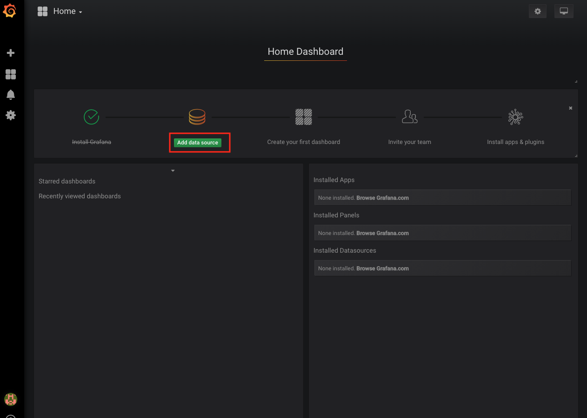

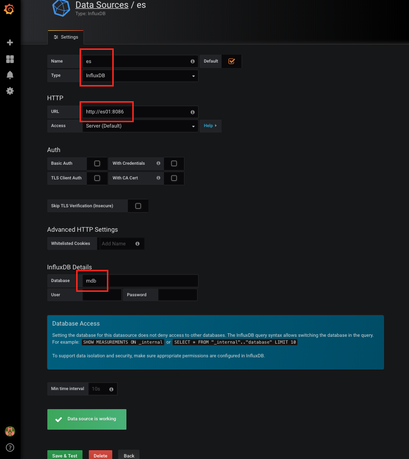

-	dashboard 만들기

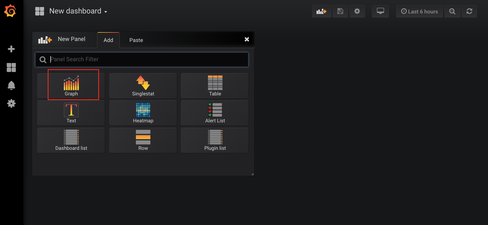

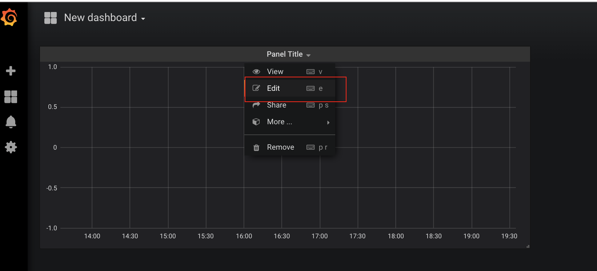

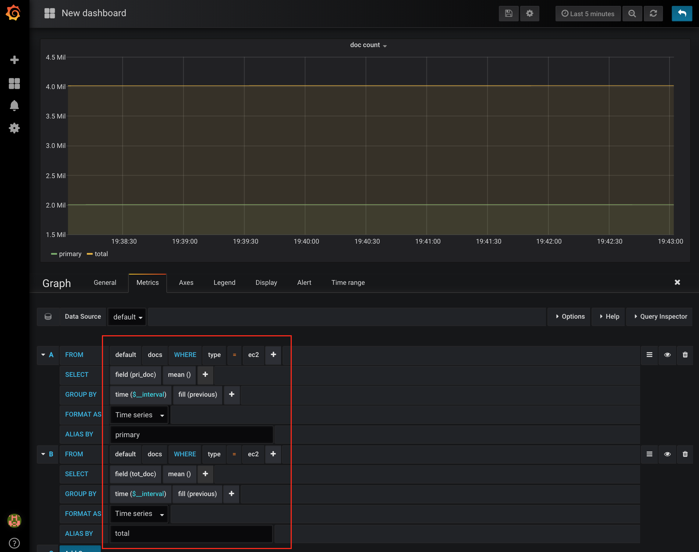

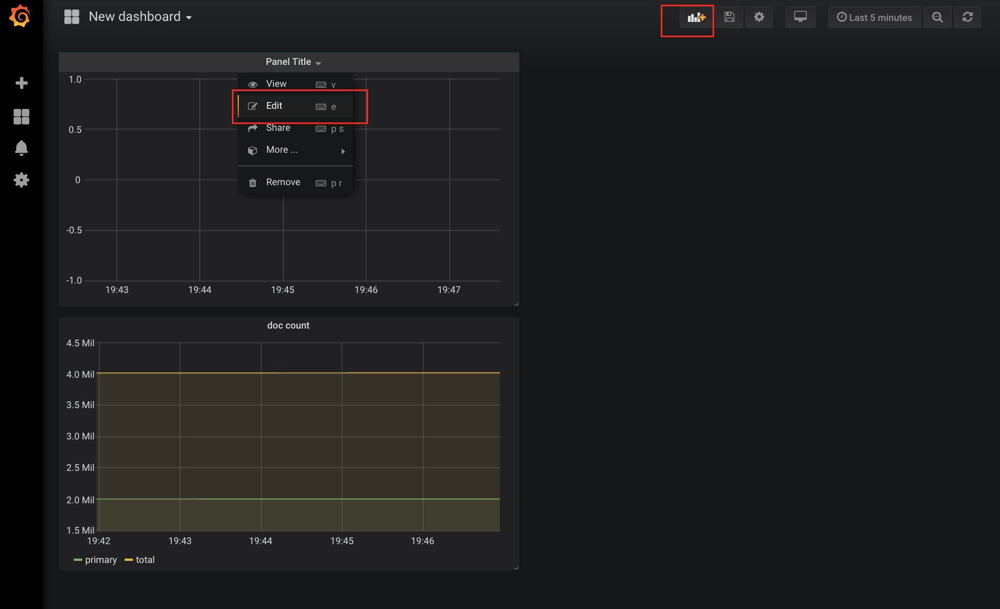

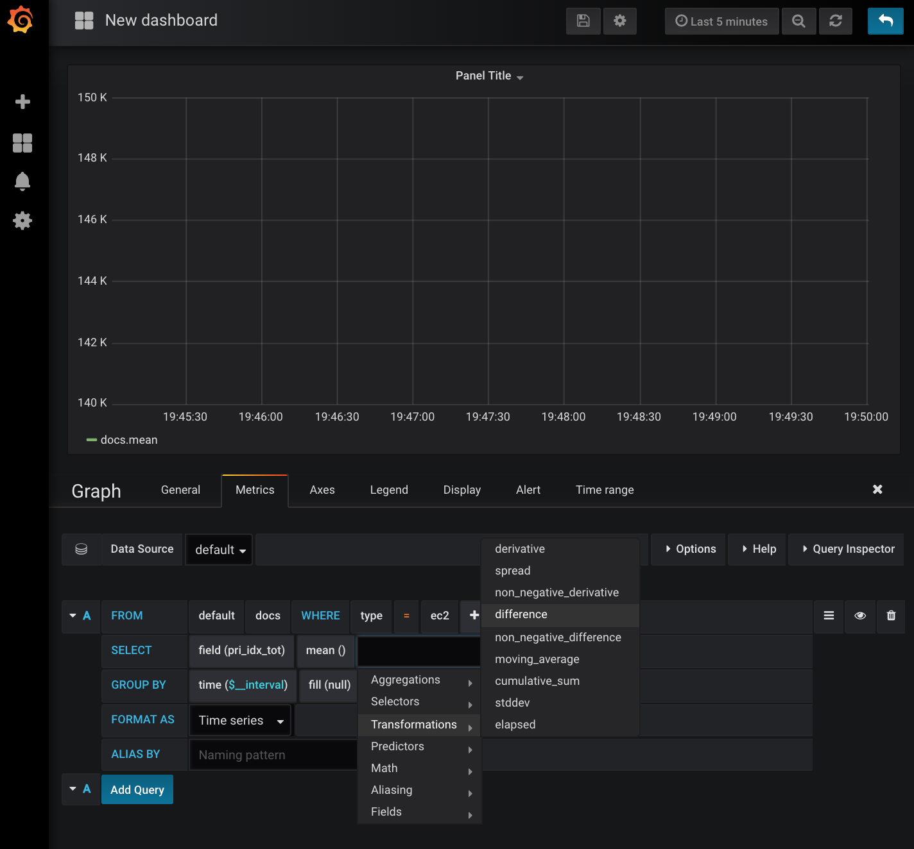

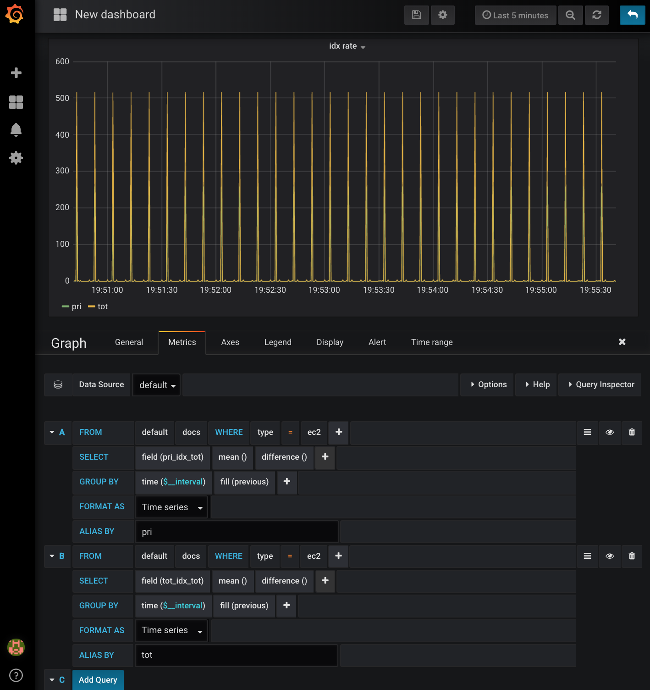

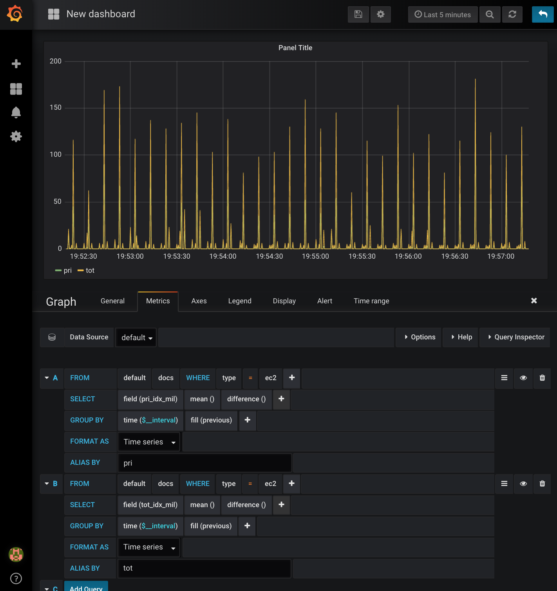

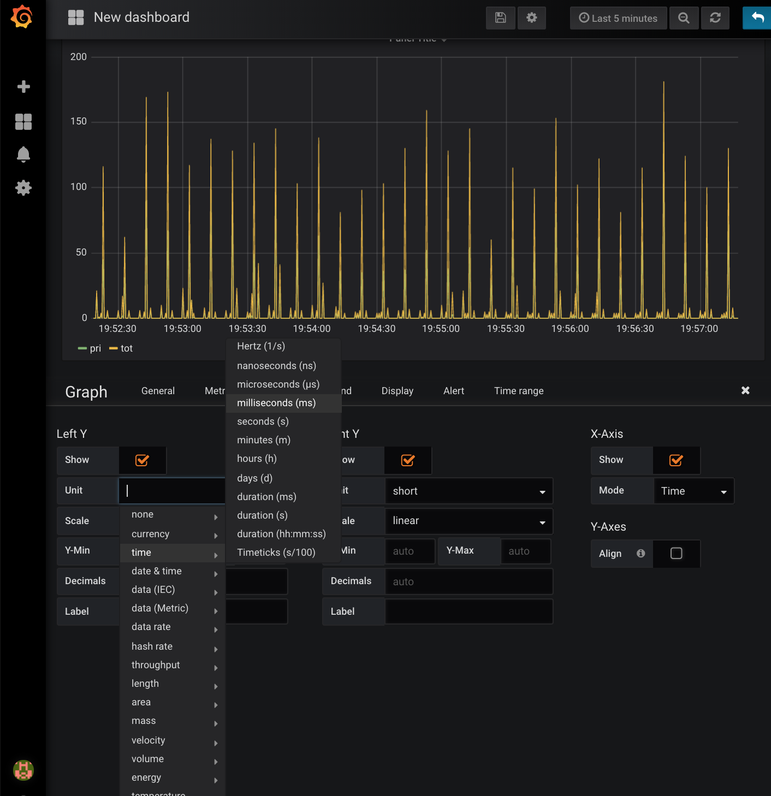

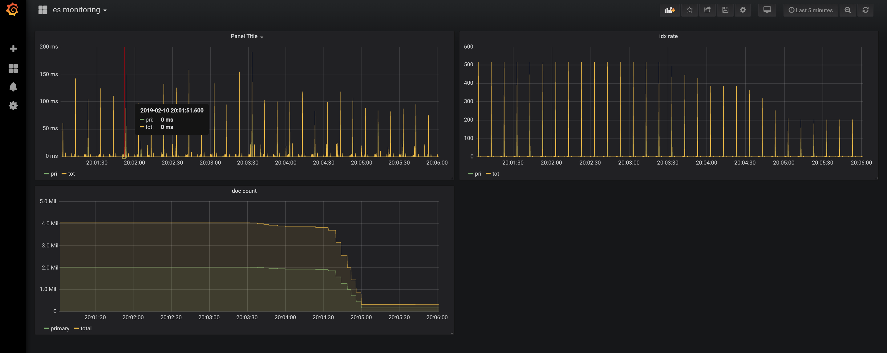

<br><br><br><br><br>

---

오픈소스 툴
===========

---

elasticdump: 인덱스 데이터 마이그레이션
---------------------------------------

<br><br>

ansible: 쉽게 배포하고, 쉽게 작업하기
-------------------------------------

<br><br>

telegram: noti pusher 활용
--------------------------

.

.

.

.

.

.

.

.

.

.

.

.

.

<br><br><br><br><br>

---

Trouble Shooting
================

---

bootstrap checks failed
-----------------------

-	Elasticsearch 가 5.0으로 올라오면서 상용모드(config 내 network.host 값이 loopback이 아닌 경우)인 경우 bootstrap 체크가 까다로워짐

```shell
bootstrap checks failed
max virtual memory areas vm.max_map_count [65530] is too low, increase to at least [262144]
```

-	실행 시 아래와 같은 메시지가 뜰 경우 vm.max_map_count 값을 262144로 변경

#### **Solution:**

-	sysctl.conf 수정

	```shell
	$ sudo vi /etc/sysctl.conf
	# 다음을 추가 또는 변경
	vm.max_map_count=262144
	```

-	command에서 변경

	```shell
	$ /usr/sbin/sysctl -w vm.max_map_count=262144
	```

-	vm.max_map_count 값 확인 방법

	```shell
	cat /proc/sys/vm/max_map_count
	```

-	참고 ([링크](https://www.elastic.co/guide/en/elasticsearch/reference/current/vm-max-map-count.html)\)

<br><br><br><br>

클라이언트에 빈번하게 EsRejectedExecutionException가 발생할때,
--------------------------------------------------------------

-	bulk insert되는 속도가 느려지고, 자주 익셉션이 발생하는 경우
-	bulk queue가 너무 적은 것은 아닌가 의심 필요
-	thread pool 상태를 봤을 때, `rejected`된 건수가 많이 보일때

<br>

-	버전6.3부터 bulk --> write로 변경됨
